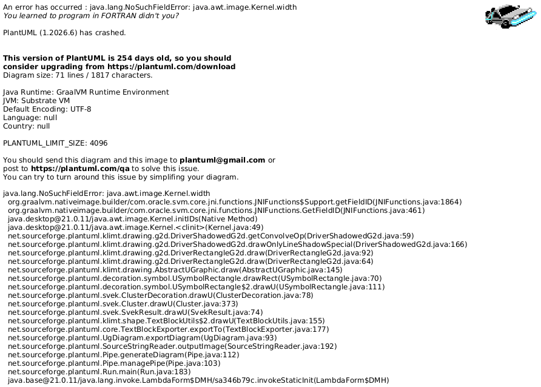
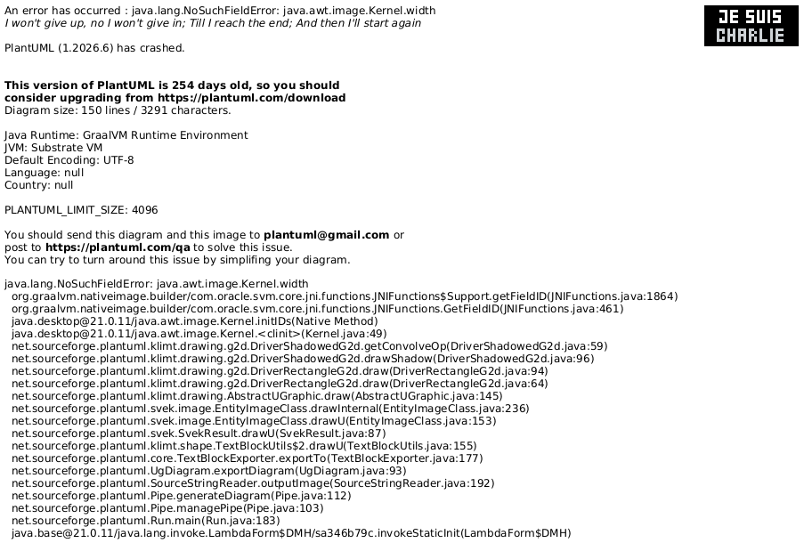
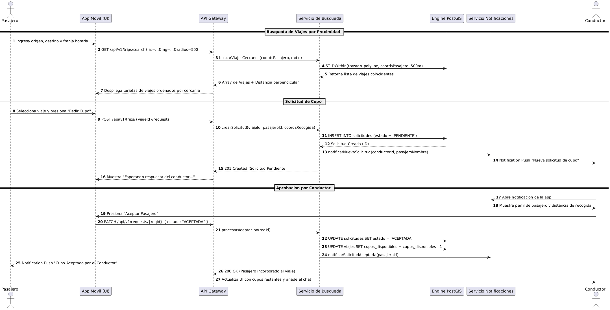
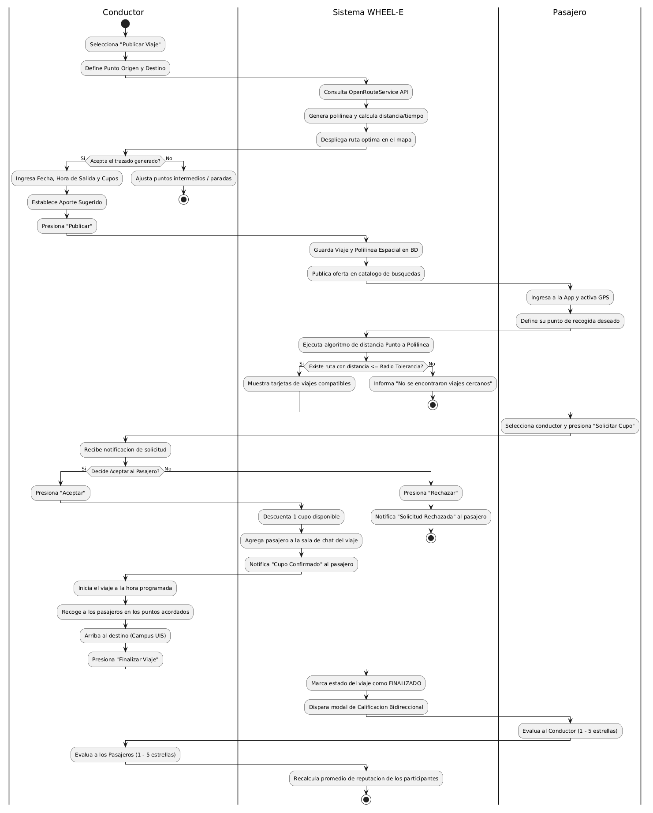
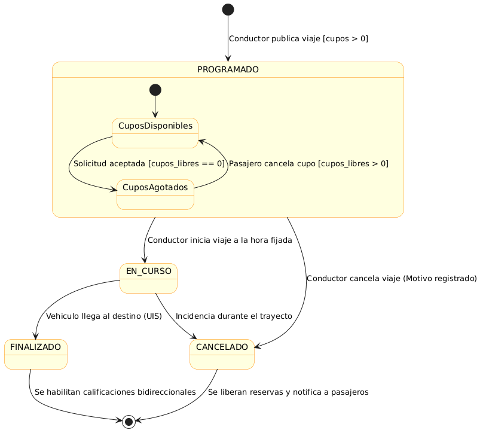
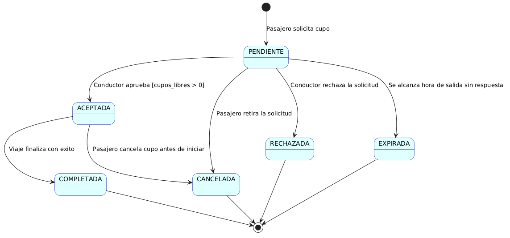
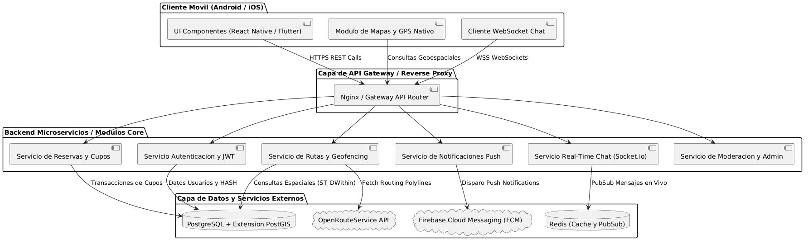
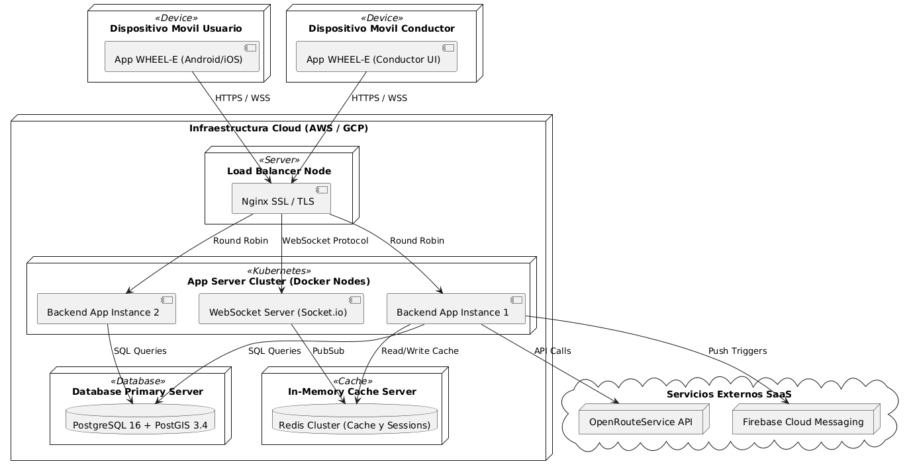
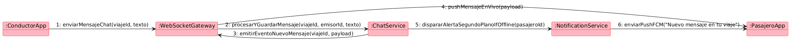
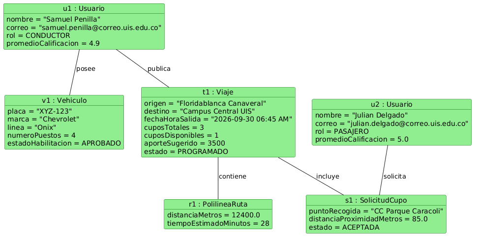

# Documentación de Diagramas UML - WHEEL-E

Este directorio contiene los diagramas UML del sistema **WHEEL-E**, diseñados y estructurados bajo los estándares de Ingeniería de Software para representar la arquitectura, comportamiento, estructuras de datos y despliegue de la plataforma de carpooling universitario para la comunidad de la Universidad Industrial de Santander (UIS).

---

## Índice de Diagramas

1. [Diagrama de Casos de Uso](#1-diagrama-de-casos-de-uso)
2. [Diagrama de Clases del Dominio](#2-diagrama-de-clases-del-dominio)
3. [Diagrama de Secuencia - Búsqueda y Reserva](#3-diagrama-de-secuencia---búsqueda-y-reserva)
4. [Diagrama de Actividades - Flujo de Viaje](#4-diagrama-de-actividades---flujo-de-viaje)
5. [Diagrama de Estados del Viaje](#5-diagrama-de-estados-del-viaje)
6. [Diagrama de Estados de la Solicitud](#6-diagrama-de-estados-de-la-solicitud)
7. [Diagrama de Componentes de Arquitectura](#7-diagrama-de-componentes-de-arquitectura)
8. [Diagrama de Despliegue en la Nube](#8-diagrama-de-despliegue-en-la-nube)
9. [Diagrama de Comunicación - Chat y Notificaciones](#9-diagrama-de-comunicación---chat-y-notificaciones)
10. [Diagrama de Objetos / Instancias](#10-diagrama-de-objetos--instancias)

---

### 1. Diagrama de Casos de Uso
Modela la interacción entre los actores del sistema (`Pasajero UIS`, `Conductor Habilitado`, `Administrador Plataforma` y el `Servicio Externo de Rutas`) y los requerimientos funcionales (RF1 al RF16).

* *Código fuente:* [`casos_de_uso.puml`](casos_de_uso.puml)

---

### 2. Diagrama de Clases del Dominio
Define la estructura estática de entidades, atributos, enumeraciones de estado y multiplicidades de las relaciones del negocio (`Usuario`, `Vehiculo`, `DocumentoVehiculo`, `Viaje`, `PolilineaRuta`, `SolicitudCupo`, `Calificacion`, `ChatMensaje`).

* *Código fuente:* [`clases_dominio.puml`](clases_dominio.puml)

---

### 3. Diagrama de Secuencia - Búsqueda y Reserva
Muestra la interacción paso a paso en el tiempo entre la App Móvil, API Gateway, Servicio de Búsqueda Geoespacial, Motor PostGIS, Servicio de Notificaciones Push y el Conductor.

* *Código fuente:* [`secuencia_reserva.puml`](secuencia_reserva.puml)

---

### 4. Diagrama de Actividades - Flujo de Viaje
Representa el flujo de trabajo operacional en paralelo con carriles (*swimlanes*) desde que el conductor publica el viaje, la API traza la ruta, el pasajero busca por proximidad, reserva, viaja y se realiza la calificación bidireccional.

* *Código fuente:* [`actividades_flujo_viaje.puml`](actividades_flujo_viaje.puml)

---

### 5. Diagrama de Estados del Viaje
Muestra las transiciones del viaje desde su creación (`PROGRAMADO`), cuando tiene cupos disponibles o agotados, cuando inicia (`EN_CURSO`), finaliza (`FINALIZADO`) o se aborta (`CANCELADO`).

* *Código fuente:* [`estados_viaje.puml`](estados_viaje.puml)

---

### 6. Diagrama de Estados de la Solicitud
Modela el ciclo de vida de una reserva de asiento desde el estado `PENDIENTE`, pasando por `ACEPTADA`, `RECHAZADA`, `CANCELADA` o `EXPIRADA`.

* *Código fuente:* [`estados_solicitud.puml`](estados_solicitud.puml)

---

### 7. Diagrama de Componentes de Arquitectura
Especifica los módulos lógicos del sistema, incluyendo clientes móviles, API Gateway, microservicios backend, bases de datos (`PostgreSQL + PostGIS`, `Redis`) y APIs de terceros (`OpenRouteService`, `Firebase FCM`).

* *Código fuente:* [`componentes_sistema.puml`](componentes_sistema.puml)

---

### 8. Diagrama de Despliegue en la Nube
Ilustra los nodos físicos e infraestructura cloud (Nginx Load Balancer, Kubernetes App Server Cluster, PostgreSQL Node, Redis Cluster, SaaS FCM y Routing API).

* *Código fuente:* [`despliegue_arquitectura.puml`](despliegue_arquitectura.puml)

---

### 9. Diagrama de Comunicación - Chat y Notificaciones
Ilustra el intercambio ordenado de mensajes en tiempo real entre los objetos `ConductorApp`, `WebSocketGateway`, `ChatService`, `NotificationService` y `PasajeroApp`.

* *Código fuente:* [`comunicacion_chat_notificaciones.puml`](comunicacion_chat_notificaciones.puml)

---

### 10. Diagrama de Objetos / Instancias
Muestra una foto en tiempo real del estado de los objetos instanciados para un viaje activo real entre Samuel Penilla (Conductor) y Julián Delgado (Pasajero).

* *Código fuente:* [`objetos_ejemplo.puml`](objetos_ejemplo.puml)

---

## ¿Cómo modificar o regenerar estos diagramas?

Cada archivo `.png` cuenta con su correspondiente fuente `.puml` en PlantUML. Para modificarlos:
1. Edita el archivo `.puml` deseado en este directorio.
2. Puedes previsualizarlos en cualquier editor con extensión de PlantUML (VS Code, JetBrains, IntelliJ) o renderizarlos mediante la CLI de PlantUML o servidor Kroki.
